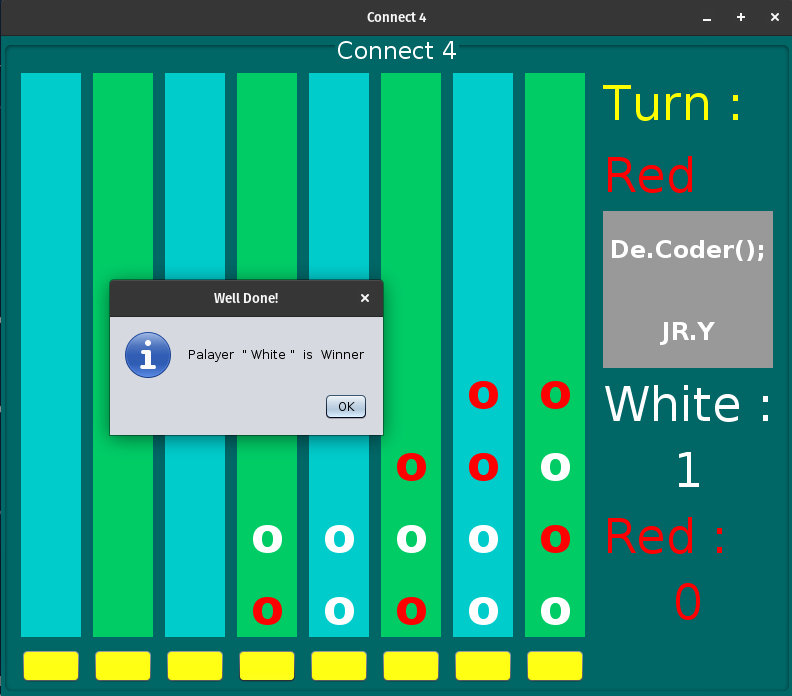

# Connect-Four-Game

My 3rd project was in the "Advance Programming" course at spring 2016 when I was in the 2nd semester of my bachelor's at IAUSTB. Connect Four (also known as Connect 4, Four Up, Plot Four, Find Four, Captain's Mistress, Four in a Row, Drop Four, and Gravitrips in the Soviet Union) is a two-player connection board game, in which the players choose a color and then take turns dropping colored tokens into a seven-column, six-row vertically suspended grid. The pieces fall straight down, occupying the lowest available space within the column. The objective of the game is to be the first to form a horizontal, vertical, or diagonal line of four of one's own tokens. Connect Four is a solved game. The first player can always win by playing the right moves.

# Tutorial Videos
I have explained how to write the code of this game in the form of several tutorial videos. To view these videos, refer to this link: https://youtube.com/playlist?list=PL1y-Wxcd3C6AF53Y4Rr8eyP5eZ0ZsChUa

|  | 
|:--:| 
| *output* |
